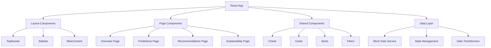

# Design Document

## Overview

The Predictive Hospital AI Dashboard is a React-based frontend application that provides hospital staff with a comprehensive view of patient surge predictions, resource metrics, and AI-generated recommendations. The application uses a modern tech stack including React, TailwindCSS, Recharts, and ShadCN UI to create a responsive, accessible, and professional medical interface.

The design follows a single-page application (SPA) architecture with client-side routing, dummy data simulation, and responsive design principles to ensure optimal user experience across desktop and mobile devices.

## Architecture

### High-Level Architecture



### Technology Stack

- **Frontend Framework**: React 18+ with TypeScript
- **Styling**: TailwindCSS for utility-first styling
- **UI Components**: ShadCN UI for consistent component library
- **Charts**: Recharts for data visualization
- **Routing**: React Router for client-side navigation
- **State Management**: React Context API + useReducer for global state
- **Build Tool**: Vite for fast development and building

## Components and Interfaces

### Layout Components

#### TopNavbar Component

```typescript
interface TopNavbarProps {
  title: string;
  currentTime: Date;
  status: "normal" | "alert" | "surge";
}
```

**Responsibilities:**

- Display application title "Predictive Hospital AI"
- Show current date/time with auto-update every minute
- Display system status indicator with appropriate colors and icons
- Responsive design that adapts to mobile screens

#### Sidebar Component

```typescript
interface SidebarProps {
  activeTab: string;
  onTabChange: (tab: string) => void;
  isMobile: boolean;
  isCollapsed: boolean;
  onToggle: () => void;
}
```

**Responsibilities:**

- Navigation between Overview, Predictions, Recommendations, Explainability
- Collapsible hamburger menu for mobile devices
- Active state indication for current page
- Smooth transitions and animations

### Page Components

#### Overview Page

```typescript
interface OverviewPageProps {
  metrics: HospitalMetrics;
  forecastData: PatientForecast[];
  alerts: Alert[];
}

interface HospitalMetrics {
  aqi: number;
  bedOccupancy: number;
  icuUsage: number;
  staffAvailability: number;
}
```

**Components:**

- StatsCards: Display key metrics in card format
- ForecastChart: 7-day patient inflow line chart
- AlertBanner: Prominent surge warnings

#### Predictions Page

```typescript
interface PredictionsPageProps {
  forecastData: PredictionData[];
  filters: PredictionFilters;
  onFilterChange: (filters: PredictionFilters) => void;
}

interface PredictionFilters {
  eventType: "festival" | "pollution" | "epidemic" | "all";
  timeframe: "24h" | "72h" | "7d";
}
```

**Components:**

- InteractiveChart: Line or heatmap visualization
- FilterControls: Event type and timeframe selectors
- PredictionSummary: Key insights and confidence levels

#### Recommendations Page

```typescript
interface RecommendationsPageProps {
  recommendations: Recommendation[];
  onRecommendationAction: (
    id: string,
    action: "accept" | "modify" | "dismiss"
  ) => void;
}

interface Recommendation {
  id: string;
  category: "staffing" | "supplies" | "advisory";
  title: string;
  description: string;
  priority: "high" | "medium" | "low";
  status: "pending" | "accepted" | "dismissed";
}
```

**Components:**

- RecommendationCards: Grouped by category
- ActionButtons: Accept, Modify, Dismiss functionality
- CategoryTabs: Filter by recommendation type

#### Explainability Page

```typescript
interface ExplainabilityPageProps {
  explanations: Explanation[];
}

interface Explanation {
  id: string;
  title: string;
  details: ExplanationDetail[];
  confidence: number;
  sources: DataSource[];
}
```

**Components:**

- AccordionSections: Expandable explanation details
- ConfidenceIndicator: Visual confidence level display
- SourceCitations: Data source references

### Shared Components

#### Chart Components

- **LineChart**: Patient inflow forecasts and trends
- **HeatmapChart**: Prediction intensity visualization
- **BarChart**: Comparative metrics display
- **DonutChart**: Percentage-based metrics (bed occupancy, etc.)

#### UI Components

- **StatsCard**: Metric display with trend indicators
- **AlertBanner**: Prominent warning messages
- **FilterDropdown**: Multi-select filtering interface
- **ActionButton**: Consistent button styling
- **LoadingSpinner**: Data loading states
- **EmptyState**: No data available states

## Data Models

### Core Data Types

```typescript
// Hospital Metrics
interface HospitalMetrics {
  aqi: number;
  bedOccupancy: number;
  icuUsage: number;
  staffAvailability: number;
  timestamp: Date;
}

// Patient Forecast
interface PatientForecast {
  date: Date;
  predicted: number;
  confidence: number;
  eventType?: string;
}

// Alert System
interface Alert {
  id: string;
  type: "surge" | "warning" | "info";
  message: string;
  timestamp: Date;
  severity: "high" | "medium" | "low";
}

// Recommendations
interface Recommendation {
  id: string;
  category: "staffing" | "supplies" | "advisory";
  title: string;
  description: string;
  priority: "high" | "medium" | "low";
  status: "pending" | "accepted" | "dismissed" | "modified";
  createdAt: Date;
}

// Explanations
interface Explanation {
  id: string;
  title: string;
  details: ExplanationDetail[];
  confidence: number;
  sources: DataSource[];
}

interface ExplanationDetail {
  factor: string;
  value: string;
  impact: string;
  change?: string;
}

interface DataSource {
  name: string;
  url?: string;
  lastUpdated: Date;
}
```

### Mock Data Service

```typescript
class MockDataService {
  // Generate realistic hospital metrics
  generateHospitalMetrics(): HospitalMetrics;

  // Create patient forecast data with seasonal patterns
  generatePatientForecast(days: number): PatientForecast[];

  // Generate contextual alerts based on current conditions
  generateAlerts(): Alert[];

  // Create diverse recommendations across categories
  generateRecommendations(): Recommendation[];

  // Generate detailed explanations with confidence levels
  generateExplanations(): Explanation[];

  // Simulate real-time data updates
  simulateRealTimeUpdates(): void;
}
```

## Error Handling

### Error Boundaries

- **Global Error Boundary**: Catch and display application-level errors
- **Component Error Boundaries**: Isolate errors to specific sections
- **Chart Error Handling**: Graceful fallbacks for chart rendering issues

### Error States

- **Network Simulation**: Mock network delays and failures
- **Data Validation**: Ensure mock data integrity
- **Graceful Degradation**: Partial functionality when components fail
- **User Feedback**: Clear error messages and recovery options

### Loading States

- **Skeleton Loading**: Placeholder content during data loading
- **Progressive Loading**: Load critical content first
- **Optimistic Updates**: Immediate UI feedback for user actions

## Testing Strategy

### Unit Testing

- **Component Testing**: React Testing Library for component behavior
- **Hook Testing**: Custom hooks for state management and data fetching
- **Utility Testing**: Data transformation and formatting functions
- **Mock Data Testing**: Ensure realistic and consistent dummy data

### Integration Testing

- **Page Flow Testing**: Navigation and state persistence
- **Filter Integration**: Chart updates with filter changes
- **Responsive Testing**: Mobile and desktop layout validation
- **Accessibility Testing**: Screen reader and keyboard navigation

### Visual Testing

- **Storybook**: Component documentation and visual testing
- **Responsive Design**: Multiple viewport testing
- **Theme Consistency**: Color scheme and typography validation
- **Chart Rendering**: Data visualization accuracy

### Performance Testing

- **Bundle Size**: Optimize for fast loading
- **Rendering Performance**: Efficient re-renders and memoization
- **Memory Usage**: Prevent memory leaks in long-running sessions
- **Mobile Performance**: Smooth interactions on mobile devices

## Responsive Design

### Breakpoints

- **Mobile**: 320px - 768px (hamburger menu, compact cards)
- **Tablet**: 768px - 1024px (collapsible sidebar, medium cards)
- **Desktop**: 1024px+ (full sidebar, expanded layout)

### Mobile Optimizations

- **Hamburger Navigation**: Collapsible sidebar menu
- **Compact View**: Top 3 alerts and recommendations only
- **Touch-Friendly**: Larger tap targets and spacing
- **Simplified Charts**: Optimized for small screens

### Accessibility

- **WCAG 2.1 AA Compliance**: Color contrast, keyboard navigation
- **Screen Reader Support**: Proper ARIA labels and descriptions
- **Focus Management**: Logical tab order and focus indicators
- **Alternative Text**: Descriptive alt text for charts and icons

## Styling and Theming

### Design System

- **Color Palette**: Clinical whites, grays, blue highlights, alert colors
- **Typography**: Clean, readable fonts optimized for medical data
- **Spacing**: Consistent spacing scale using Tailwind utilities
- **Shadows**: Soft shadows for depth and hierarchy
- **Border Radius**: 2xl rounded corners for modern appearance

### Component Styling

- **ShadCN UI Integration**: Consistent component library
- **Custom CSS Variables**: Theme customization support
- **Dark Mode Ready**: Prepared for future dark theme implementation
- **Print Styles**: Optimized for printing reports and charts

This design provides a solid foundation for building a professional, responsive, and user-friendly hospital dashboard that meets all the specified requirements while maintaining high code quality and user experience standards.
